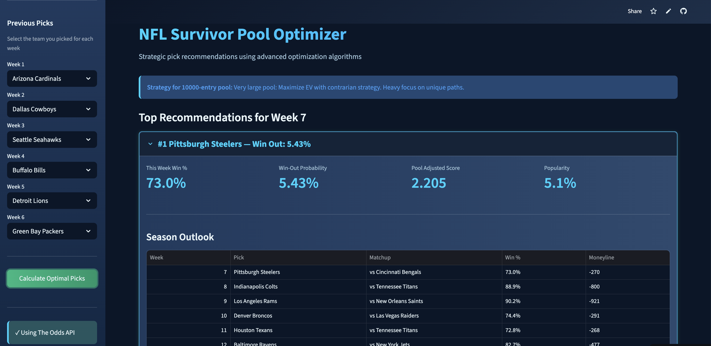

# NFL Survivor Pool Optimizer

A data-driven Streamlit application that uses the Hungarian algorithm to optimize NFL Survivor Pool picks for the entire season. This tool helps you maximize your probability of winning by finding the optimal path through all remaining weeks.

## Overview

NFL Survivor Pools require you to pick one team to win each week, but you can only use each team once per season. This creates a complex optimization problem: which team should you pick this week to maximize your chances of surviving the entire season?

This application solves that problem using advanced optimization techniques and real-time betting data.

## Key Features

- **Hungarian Algorithm Optimization**: Uses linear sum assignment to find the optimal team selection path
- **Real-Time Odds Integration**: Pulls live moneylines from The Odds API
- **Season-Long Projections**: Scrapes future week projections from SurvivorGrid
- **Pool Size Adjustments**: Tailors recommendations based on your pool's size (contrarian vs. consensus strategies)
- **Interactive UI**: Week-by-week team selection with smart filtering
- **Complete Season Outlook**: Shows your optimal path from current week through Week 18

## How It Works

### The Optimization Algorithm

The app uses the **Hungarian Algorithm** (linear sum assignment) to solve the assignment problem:
- **Goal**: Maximize the probability of winning out (surviving all remaining weeks)
- **Constraint**: Each team can only be used once
- **Method**: Convert to a cost minimization problem using `-log(win_probability)`
  - Minimizing the sum of `-log(p)` = Maximizing the product of probabilities
  - This finds the path with the highest overall win-out probability

### Data Sources

1. **The Odds API** - Current week moneylines (accurate, real-time betting odds)
2. **SurvivorGrid** - Future week projections and pick percentages (consensus data)

### Pool Size Strategy

- **Small pools (< 50)**: Favor higher win probabilities
- **Medium pools (50-200)**: Balance win probability with contrarian value
- **Large pools (200-1000)**: Emphasize contrarian picks to differentiate
- **Very large pools (> 1000)**: Heavy contrarian strategy required

## Installation

### Prerequisites

- Python 3.8+
- pip

### Setup

1. Clone the repository:
```bash
git clone https://github.com/jlattanzi4/nfl-survivor-optimizer.git
cd nfl-survivor-optimizer
```

2. Install dependencies:
```bash
pip install -r requirements.txt
```

3. Create a `.env` file:
```bash
cp .env.example .env
```

4. (Optional) Add your Odds API key to `.env`:
   - Get a free API key at [The Odds API](https://the-odds-api.com/)
   - Add it to `.env`: `ODDS_API_KEY=your_key_here`
   - Free tier includes 500 requests/month

5. Run the app:
```bash
streamlit run app.py
```

## Usage

1. **Configure Your Pool**: Enter pool size and current week in the sidebar
2. **Enter Previous Picks**: Select which teams you've already used each week
3. **Calculate**: Click "Calculate Optimal Picks" to see recommendations
4. **Review Options**: Explore the top 5 picks with complete season paths
5. **Make Your Decision**: Choose based on your risk tolerance and pool dynamics

## Project Structure

```
nfl_survivor_optimizer/
├── app.py                          # Main Streamlit application
├── config.py                       # Configuration and constants
├── requirements.txt                # Python dependencies
├── data_collection/
│   ├── odds_api.py                # The Odds API client
│   ├── survivorgrid_scraper.py   # SurvivorGrid web scraper
│   └── data_manager.py           # Data integration layer
└── optimizer/
    ├── hungarian_optimizer.py     # Core optimization algorithm
    └── pool_calculator.py        # Pool size adjustment logic
```

## Technical Highlights

### Technologies Used
- **Streamlit**: Interactive web application framework
- **SciPy**: Linear sum assignment (Hungarian algorithm)
- **Pandas**: Data manipulation and analysis
- **Requests + BeautifulSoup**: Web scraping
- **NumPy**: Numerical computations

### Key Algorithms
- **Linear Sum Assignment**: Optimal team-to-week matching
- **Logarithmic Cost Function**: Converts probability product to sum
- **Spread-to-Probability Conversion**: `P(win) = 1 / (1 + 10^(spread/14))`
- **Moneyline-to-Probability**: Handles favorite vs. underdog calculations

## Live Demo

**Try it now:** [https://nfl-survivor-optimizer.streamlit.app/](https://nfl-survivor-optimizer.streamlit.app/)

No installation required - just visit the link and start optimizing your picks!

## Screenshots



*Interactive interface showing optimal pick recommendations with complete season outlook*

## Future Enhancements

- Historical performance tracking
- Monte Carlo simulations for variance analysis
- Multi-entry optimization (for pools allowing multiple entries)
- ML-based win probability predictions
- Weekly email notifications with picks

## License

MIT License - feel free to use this for your own survivor pools!

## Acknowledgments

- Inspired by optimization methodology discussed on r/NFLSurvivorPool
- Data provided by The Odds API and SurvivorGrid
- Built with Streamlit

---

**Note**: This tool is for entertainment and educational purposes. Always do your own research before making picks. Past performance does not guarantee future results.
