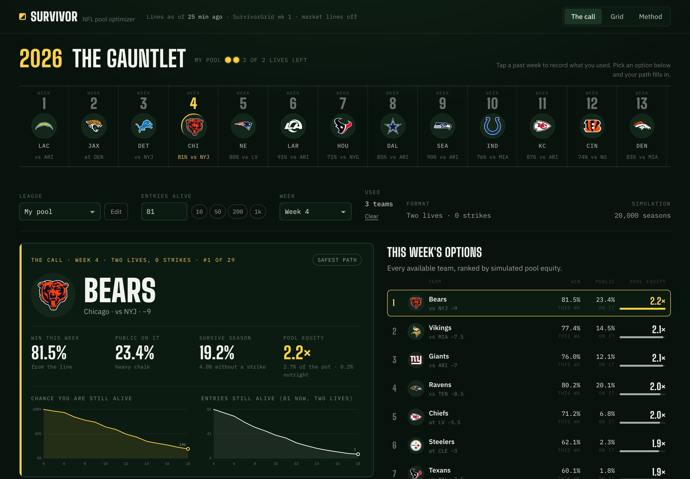

# NFL Survivor Pool Optimizer

**Live:** https://jlattanzi4.github.io/nfl-survivor-optimizer/

Pick the right team every week. A survivor pool is an assignment problem with a
twist: you need to survive, *and* you need most of the pool not to. This tool
solves the first part exactly and simulates the second.



## How it works

1. **Lines, not opinions.** Current-week win probabilities are de-vigged,
   Pinnacle-weighted consensus moneylines from The Odds API. Future weeks use
   SurvivorGrid's look-ahead spreads, converted with a logistic curve calibrated
   to historical straight-up results. Public pick shares come from SurvivorGrid
   (Yahoo / ESPN / OFP pools) for the current week and are projected for future
   weeks with a softmax fit to this week's behavior.
2. **Path search.** Each team can be used once, so the season is an 18-weeks ×
   32-teams assignment. The Hungarian algorithm solves it exactly, minimizing
   `Σ −log p` (which maximizes the product of win probabilities). A leverage
   term `λ·log(field survival)` at λ ∈ {0, ½, 1} also generates paths that lean
   on less popular teams. Every team playing this week is forced into slot one
   and the rest of the season is re-solved around it.
3. **Pool simulation.** Every candidate path is played through 20,000 simulated
   seasons against a field that picks in proportion to public shares. The rank
   metric is **pool equity**: your average share of the pot. It captures why a
   27%-owned favorite can be the wrong pick in a 1,000-entry pool and the right
   one in a 10-entry pool.

**Leagues.** Save any number of pools, each with its own name, entry count,
format and recorded picks, and switch between them. Formats: single
elimination, or two lives (an entry is out on its second loss). In two-lives
mode the simulator tracks strikes for you and for the field, and your own
strikes are counted automatically from the results of the picks you recorded.

**Sync.** Optional magic-link email sign-in (Supabase Auth) syncs leagues
across devices. Local storage stays the source of truth; changes are upserted
to a `survivor_leagues` table protected by row-level security, and remote rows
are merged in by last edit on sign-in and tab focus. Schema in
`supabase/schema.sql`; client config in `docs/js/config.js`.

Everything else runs in the browser. There is no app server.

## Architecture

```
pipeline/            Python: fetch + merge sources → docs/data/season.json
  survivorgrid.py    parser (handles neutral-site "(n)" and "PK" cells)
  odds_api.py        de-vigged, Pinnacle-weighted consensus moneylines
  popularity.py      softmax pick-share model for future weeks
  optimizer.py       reference Hungarian path search (parity-tested vs JS)
  simulate.py        reference Monte Carlo pool model (numpy)
  build.py           CLI entry point
docs/                GitHub Pages site (no build step, no framework)
  js/hungarian.js    rectangular Kuhn–Munkres
  js/optimizer.js    path search
  js/simulate.js     common-random-number pool simulation
  js/engine.js       candidate generation + ranking (runs in a Web Worker)
  js/app.js          UI
tests/               pytest: parser, odds, optimizer, simulator, JS↔Python parity
.github/workflows/   data refresh 3×/day (commits season.json), tests on push
```

## Run it locally

```bash
pip install -r requirements.txt pytest
python -m pytest -q tests/
python -m pipeline.build --no-odds          # or set ODDS_API_KEY for market lines
python -m http.server 8765 --directory docs # then open http://localhost:8765
```

`cp .env.example .env` and add your Odds API key to enable current-week market
lines. On GitHub, add the same key as the `ODDS_API_KEY` repository secret and
the scheduled workflow will use it.

## Modeling notes

- Ties count as losses (and as strikes in two-lives pools).
- Two-lives pools: the field's current strike distribution is an input (entries on their last life); the model does not try to infer it.
- The field is not constrained by teams it has already used; the public burns
  its favorites early, so late-season contrarian picks are worth slightly more
  than shown.
- Small pools are simulated with binomial draws, so variance is real: a pool of
  10 behaves differently from a pool of 10,000 with the same shares.
- Spread → probability: `p = 1 / (1 + 10^(spread/14))` (−3 → 62%, −7 → 76%,
  −10 → 84%).

## License

MIT
